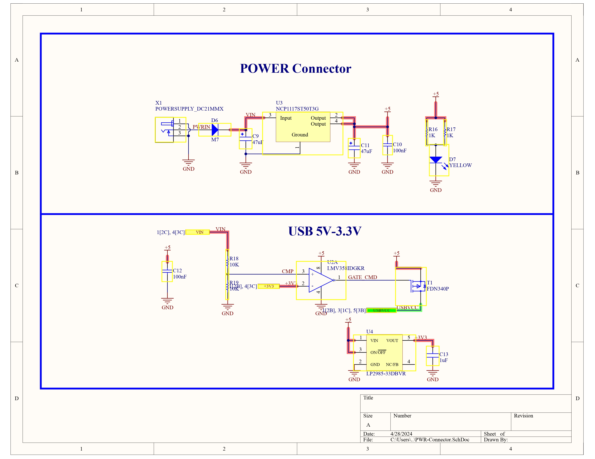
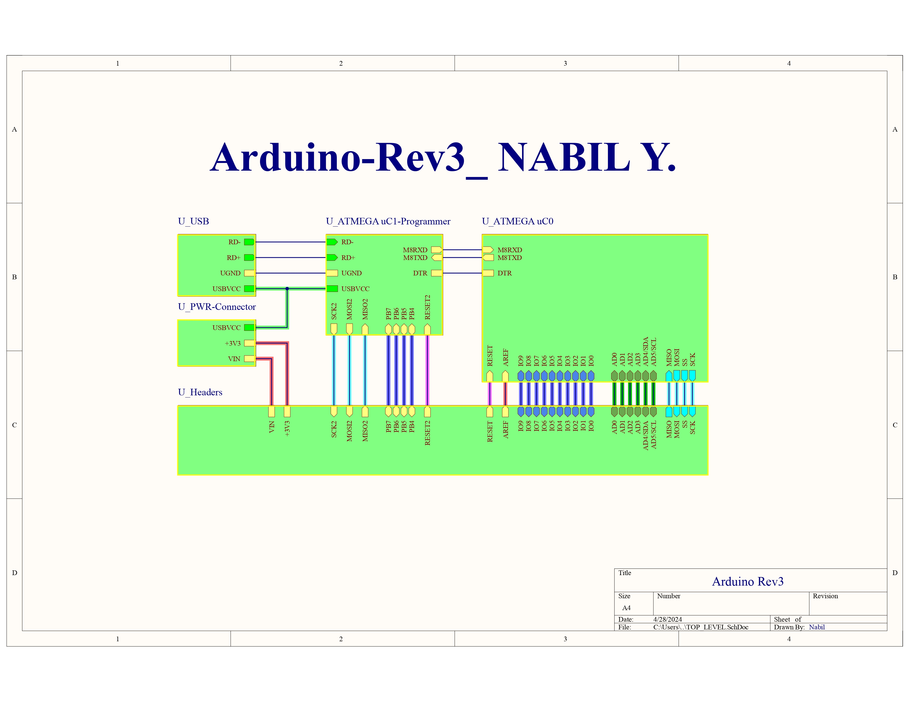
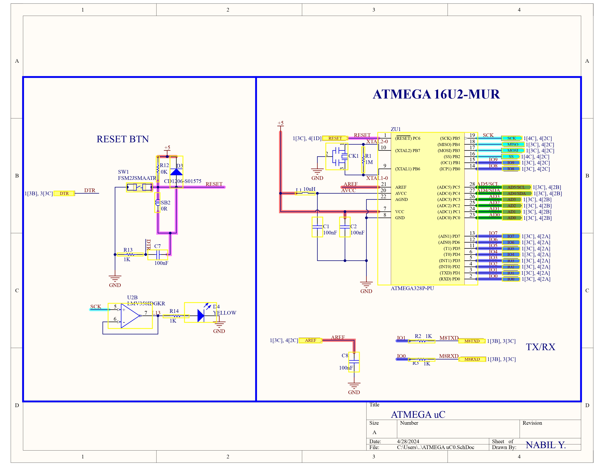
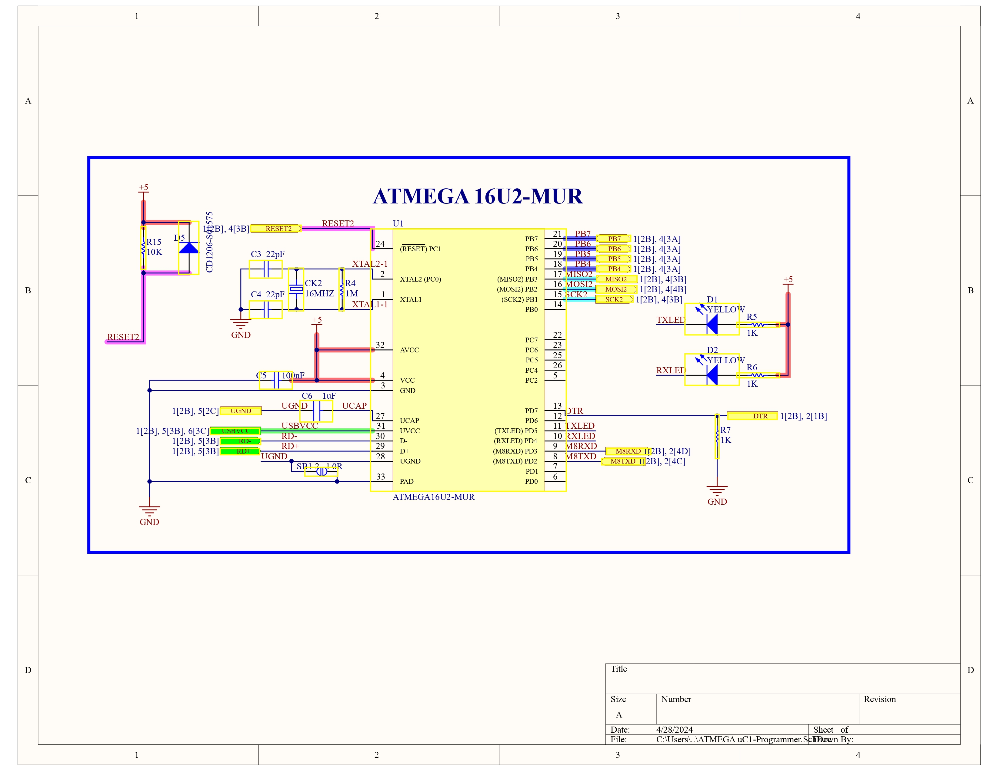
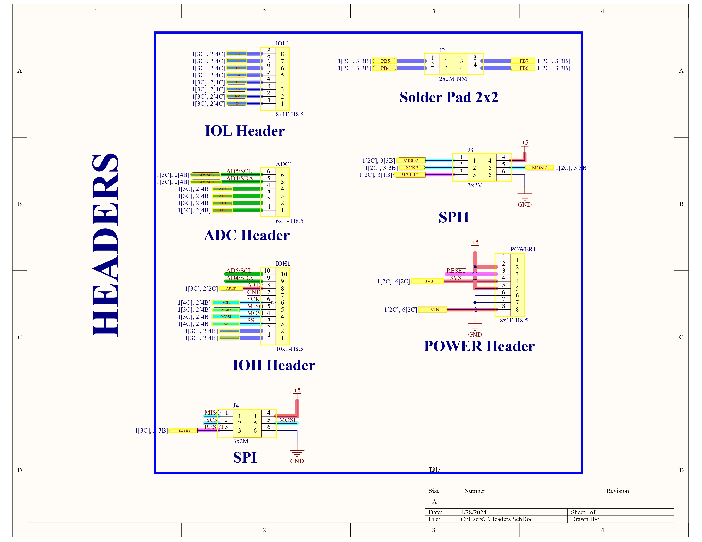
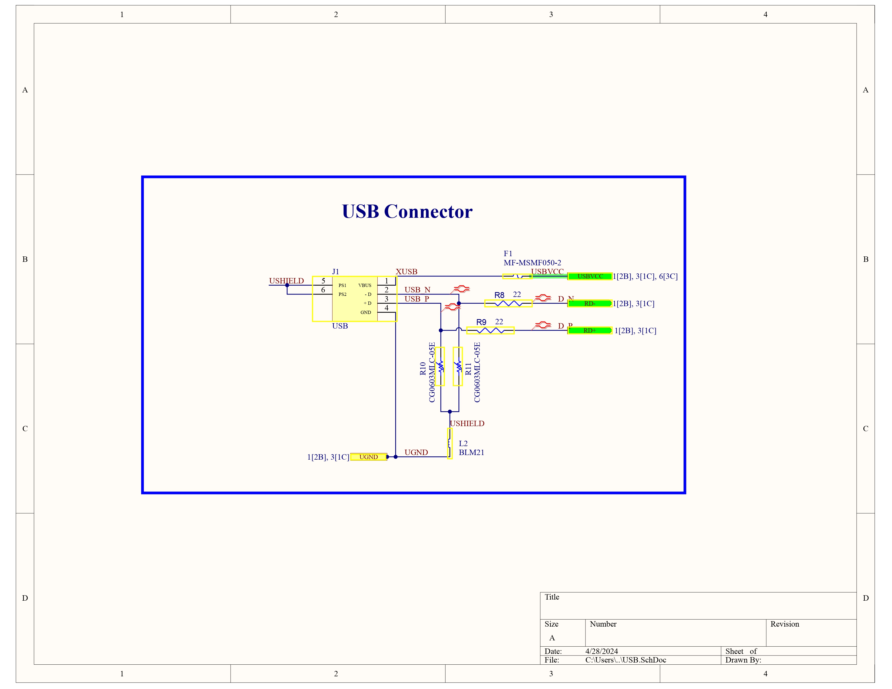
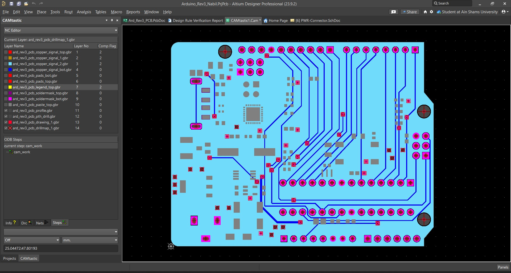
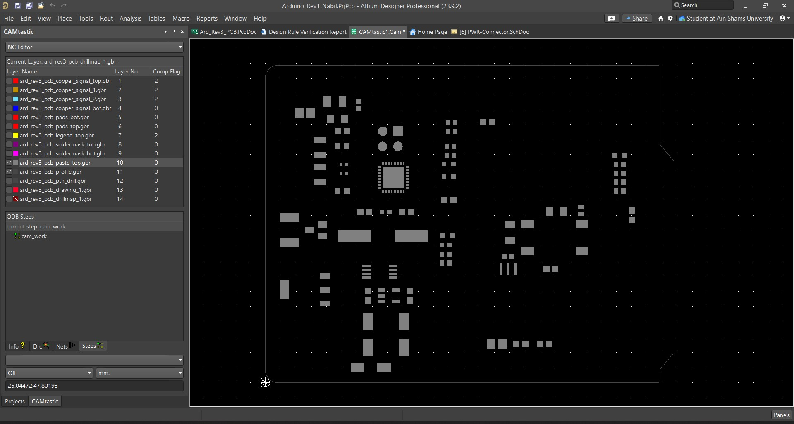
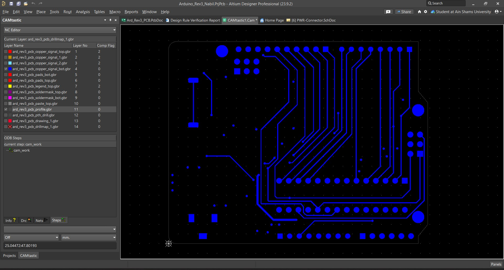
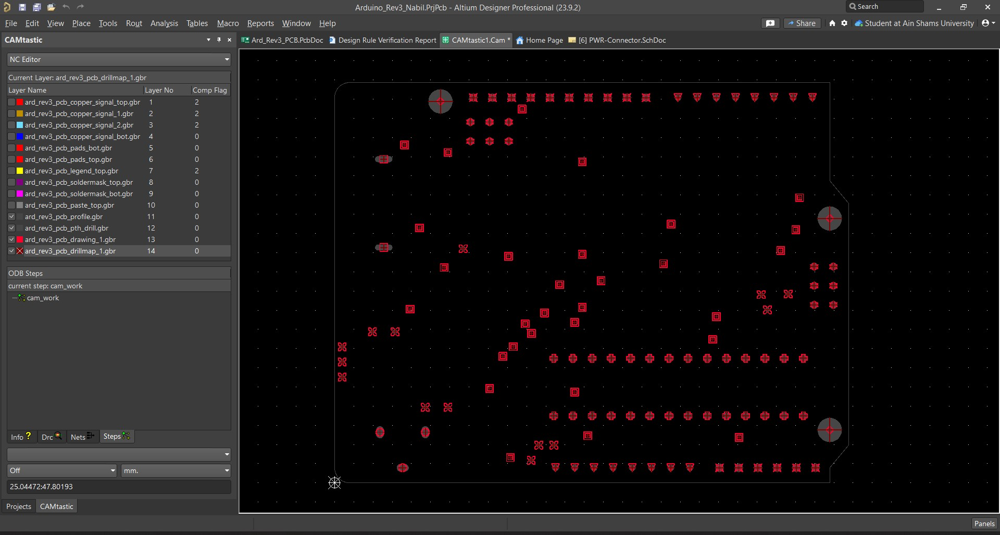

<h1 style="text-align: center;">Arduino Rev 3</h1>

## Table of Contents
- [Schematic](#schematic)
- [PCB Layout](#pcb-layout)
- [BOM (Bill of Materials)](#bom-bill-of-materials)

## Schematic

    

## PCB Layout

## Gerber Files Review

## BOM (Bill of Materials)

| P/N               | Description                                                                                          | Designator       | Quantity |
|-------------------|------------------------------------------------------------------------------------------------------|------------------|----------|
| LED-Green-0603    | Green 590nm LED Indication - Discrete 2V 0603                                                       | D7               | 1        |
| LED-Yellow-0603   | Yellow 590nm LED Indication - Discrete 2V 0603                                                      | D1, D2, D4       | 3        |
| 1001-011-01101    | USB-A (USB TYPE-A) USB 1.1 Plug Connector 4 Position Surface Mount, Right Angle; Through Hole       | J1               | 1        |
| Chip Resistor     | 22 Ohms, +/-5 %, 63 mW, -55 to 155 degC, 0402                                                       | R8, R9           | 2        |
| PJ-102BH          | DC Power Connectors Power Jacks                                                                     | X1               | 1        |
| NCP1117ST50T3G    | IC REG LINEAR 5V 1A SOT223                                                                          | U3               | 1        |
| MF-MSMF050-2      | Polymeric PTC Resettable Fuse 15V 500 mA Ih Surface Mount 1812 (4532 Metric), Concave              | F1               | 1        |
| M7                | Standard recovery rectifier diode                                                                   | D6               | 1        |
| LP2985-33DBVR     | Linear Voltage Regulator IC Positive Fixed 1 Output 150mA SOT-23-5                                  | U4               | 1        |
| LMV358IDGKR       | IC OPAMP GP 2 CIRCUIT 8VSSOP                                                                        | U2               | 1        |
| FSM2JSMAATR       | SWITCH TACTILE SPST-NO 0.05A 24V                                                                    | SW1              | 1        |
| FDN340P           | MOSFET P-CH 20V 2A SSOT3                                                                            | T1               | 1        |
| CSTCE16M0V53C-R0  | 16 MHz Ceramic Resonator Built in Capacitor 15 pF ±0.15% -40°C ~ 125°C Surface Mount                | CK1              | 1        |
| CG0603MLC-05E     | Varistor 1 Circuit Surface Mount, MLCV 0603 (1608 Metric)                                          | R10, R11         | 2        |
| CD1206-S01575     | 75 V Small Signal Switching Diode, 150 mA, 2.5 uA, 1026 Molded Package, RoHS, Tape and Reel         | D3, D5           | 2        |
| BLM21BB471SN1D    | Ferrite Beads Multi-Layer 470Ohm 25% 100MHz 400mA 400mOhm DCR 0805 Paper T/R                        | L2               | 1        |
| ATMEGA328P-PU     | AVR AVR® ATmega Microcontroller IC 8-Bit 20MHz 32KB (16K x 16) FLASH 28-PDIP                        | ZU1              | 1        |
| ATMEGA16U2-MUR    | AVR AVR® ATmega Microcontroller IC 8-Bit 16MHz 16KB (8K x 16) FLASH 32-VQFN (5x5)                   | U1               | 1        |
| KGF15AR71C104KT   | 100nF ±10% 16V Ceramic Capacitor X7R 0603                                                           | C1, C2, C5, C7, C8, C10, C12 | 7        |
| EEE1CA470WR       | 47µF 16V Aluminum Electrolytic Capacitors Radial, Can - SMD 1000 Hrs @ 85°C                        | C9, C11          | 2        |
| C0603C220J5GAC7867 | 22 pF ±5% 50V Ceramic Capacitor C0G, NP0 0603 (1608 Metric)                                         | C3, C4           | 2        |
| ECS-160-20-5PX-TR | 16 MHz ±30ppm Crystal 20pF 40 Ohms HC-49/US                                                          | CK2              | 1        |
| 831-87-010-10-001101 | 10x1 Female Header                                                                                | IOH1             | 1        |
| LBR2012T100K      | 10 µH Unshielded Wirewound Inductor 150 mA 360mOhm 0805 (2012 Metric)                               | L1               | 1        |
| CRCW060310K0FKEA  | 10 KOhm, +/- 1%, 100 mW, -55 to 155 degC, 0603 (1608 Metric), RoHS, Tape and Reel                   | R12, R15, R18, R19 | 4        |
| 5-535541-6        | 8x1 Female header                                                                                   | IOL1, POWER1     | 2        |
| NPPN061BFCN-RC    | 6x1 Female header                                                                                   | ADC1             | 1        |
| 67997-206HLF      | 3x2 Male Pin Header                                                                                 | J3, J4           | 2        |
|                   | 2x2 solder pad                                                                                      | J2               | 1        |
| CC0603KRX7R7BB105 | CAP CER 1UF 16V X7R 0603                                                                            | C6, C13          | 2        |
| ERJ-3EKF1004V     | 1 MOhms ±1% 0.1W, 1/10W Chip Resistor 0603 (1608 Metric) Automotive AEC-Q200 Thick Film             | R1, R4           | 2        |
| RC0603FR-071KL    | 1 kOhms ±1% 0.1W, 1/10W Chip Resistor 0603 (1608 Metric) Moisture Resistant Thick Film              | R2, R3, R5, R6, R7, R13, R14, R16, R17 | 9        |
| ERJ-6GEY0R00V     | Resistor Thick Film 0805 0 Ohm 1-8w Surface Mount Embossed Carrier Tape and Reel                     | SB1, SB2         | 2        |
